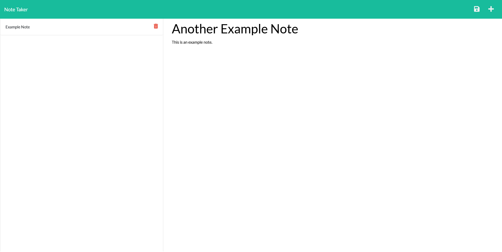

  </img>
  
# personal-note-taker

## Description
An application that utilizes node.js and express.js to generate a website (deployed on Heroku) that allows the user to create notes and save them to be viewed later.
## Table of Contents
1. [Screenshot](#screenshot)
2. [Usage](#usage)
3. [License](#license)
4. [Contributing](#contributing)
5. [Tests](#tests)
6. [Questions](#questions)

## Screenshot

## Usage
You can visit this site <a href=https://personal-note-takr.herokuapp.com/>here</a>. Once in, you can enter a title for a note and then a body. When done writing, click the save icon in the top right of the screen to save it to the bar on the side. If you want to delete a note, click the trashcan icon on the note in the sidebar.  

## Contributing
Not looking for contributions at this time.

## Tests
Currently no developed ways to test this project.

## Questions
If you have questions, you can email me at samclark2399@gmail.com or you can checkout my repos
on my <a href=https://github.com/sam-clark1>GitHub</a>.

  ## License
  Licensed under the 
  <a href=https://github.com/microsoft/vscode/blob/main/LICENSE.txt>MIT</a>
   license.
  

